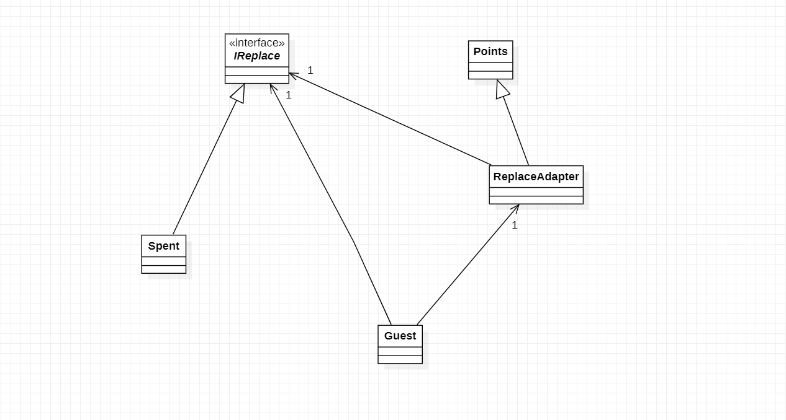

# Padrões de Projeto

## 2. Padrões de Strutural:
___
### 2.5 Adapter

#### 2.5.1 Introdução
O Adapter é um padrão de projeto estrutural que permite objetos com interfaces incompatíveis colaborarem entre si.

#### 2.5.2 Exemplo abordado

Como exemplo para este padrão abordei o tema de troca gasto por pontos
#### 2.5.3 Diagrama de Classe do Exemplo

